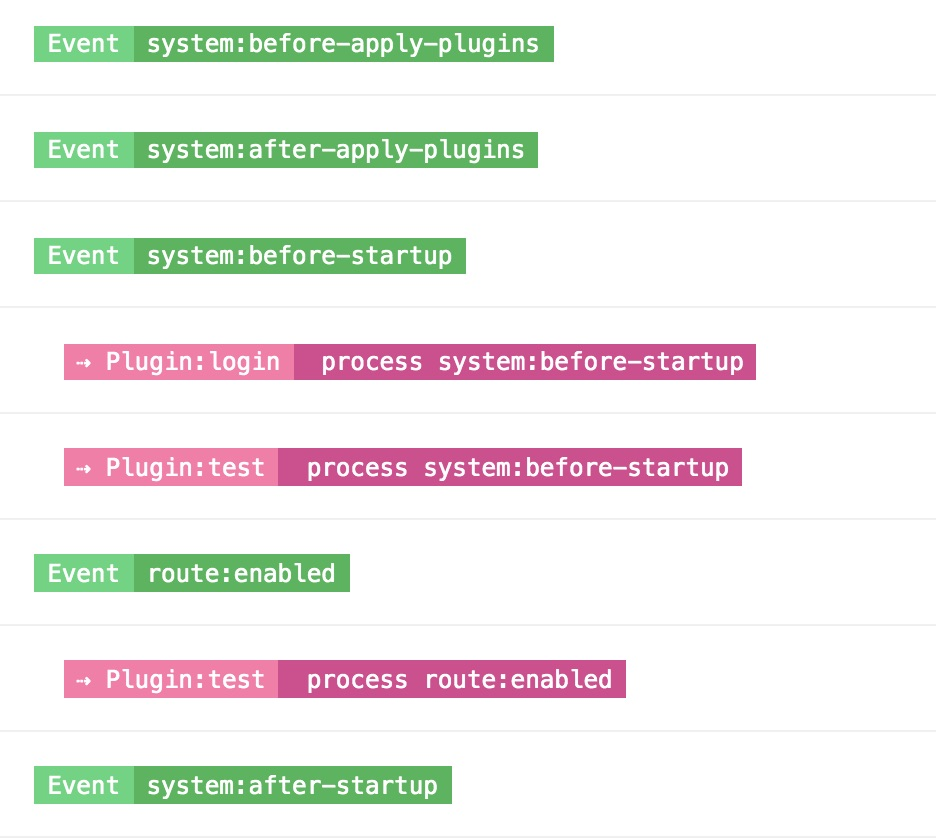
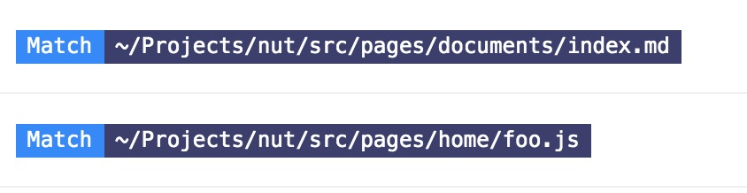
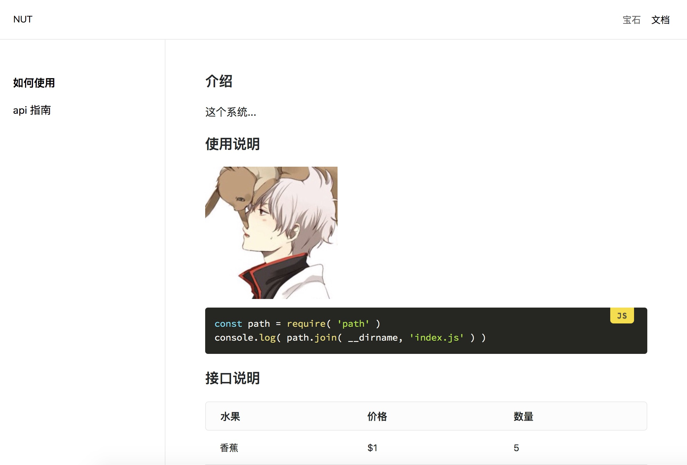

# nut-project

**开发中**

layout / theme 热重载


markdown 主题 热重载


系统事件



路由匹配



## 特性

- 灵活的 layout 机制
- 基于文件系统的路由
- 支持自定义主题
- 500+ 的内置图标
- 内置的 markdown 支持
- 内置的许多指令
- 事件系统
- 配置管理
- 热重载
- 插件化

## 内置 layout

#### default

| ocean | sakura |
| :---: | :---: |
|  |  |

#### saber

| ocean | sakura |
| :---: | :---: |
|  |  |

#### now



### 如何写一个 layout

...

### 如何写一个 plugin

一个标准的 plugin 是这样子的

```js
export default {
  name: 'your-superb-plugin',
  // 一些特殊类型的插件需要指定 type，大多数情况下你可以忽略它
  type: 'login',
  apply( ctx = {}, options = {} ) {
    const { api, events } = ctx

    api.expose( 'method_name', () => {} )
    api.expose( 'prop', 'value' )

    events.on( 'system:before-startup', async ctx => {
      await api.axios() // do some request
      await events.pluginEmit( 'some-event', data ) // emit plugin event out
    } )
  }
}
```

你可以通过 插件 向 应用 暴露一些方法，也可以监听系统事件，以及抛出插件内部的事件

#### 使用插件

nut.config.js

```js
module.exports = {
  plugins: {
    superb: {
      package: 'your-superb-plugin',
      enable: true,
    }
  }
}
```

superb 是插件在当前应用中使用的名字

以上面的插件代码为例

```js
// plugin exposed
ctx.plugins.superb.method_name()
ctx.plugins.superb.prop

// plugin events
ctx.events.on( 'plugin:superb:some-event', async data => {} )
```

- 查看完整的[开放接口](./docs/api.md)(api)
- 查看完整的[系统事件](./docs/events.md)(events)


## 如何开始

```bash
yarn global add @nut-project/cli
```

```bash
nut # develop locally
nut --prod # build for production
```
