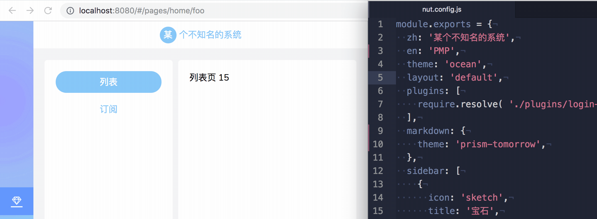
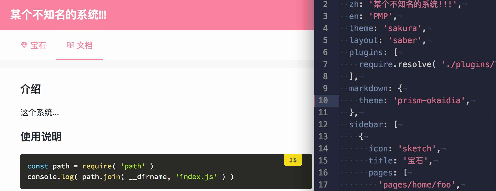

# nut-project

**开发中**




## 特性

- 灵活的 layout 机制
- 基于文件系统的路由
- 支持自定义主题
- 500+ 的内置图标
- 内置的 markdown 支持
- 内置的许多指令
- 事件系统
- 配置管理
- 热重载
- 插件化

## 内置 layout

### default

| ocean | sakura |
| :---: | :---: |
|  |  |

### saber

| ocean | sakura |
| :---: | :---: |
|  |  |

## 如何开始

```bash
yarn global add @nut-project/cli
```

```bash
nut # develop locally
nut --prod # build for production
```
